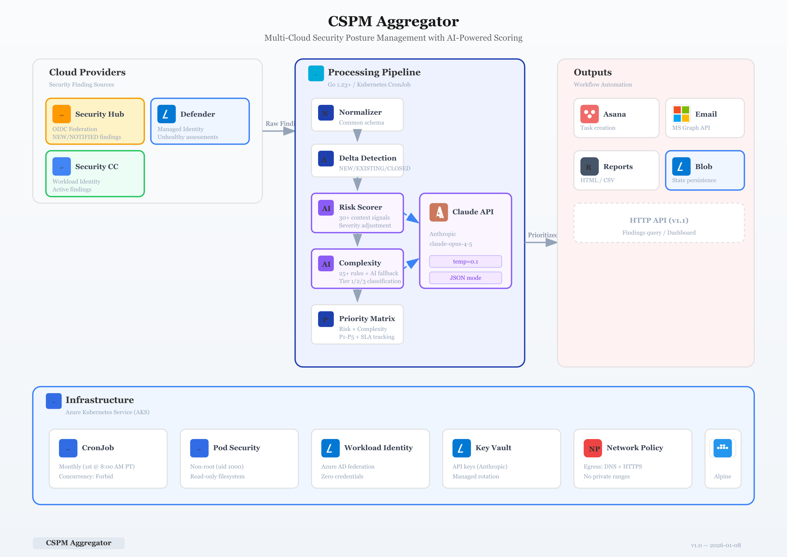
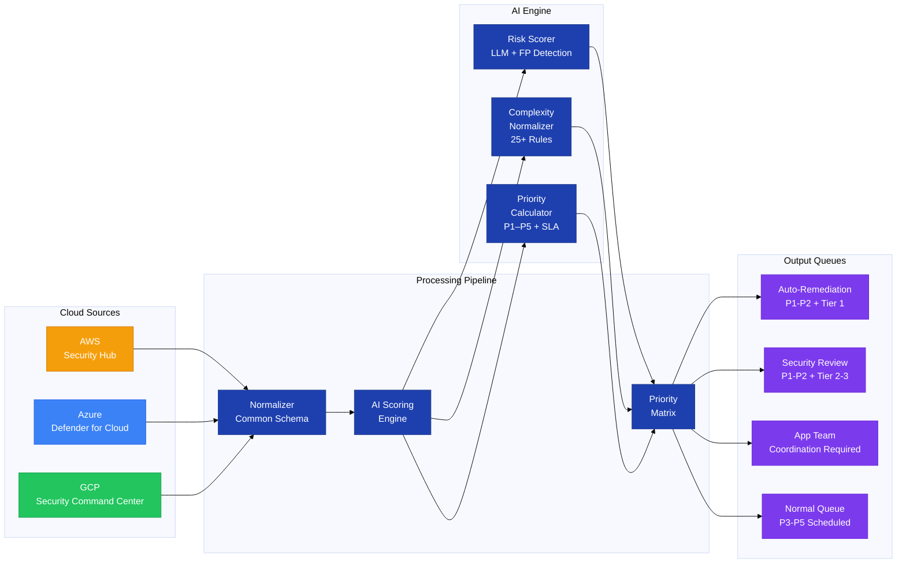
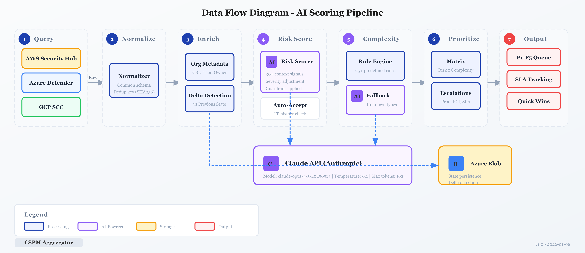
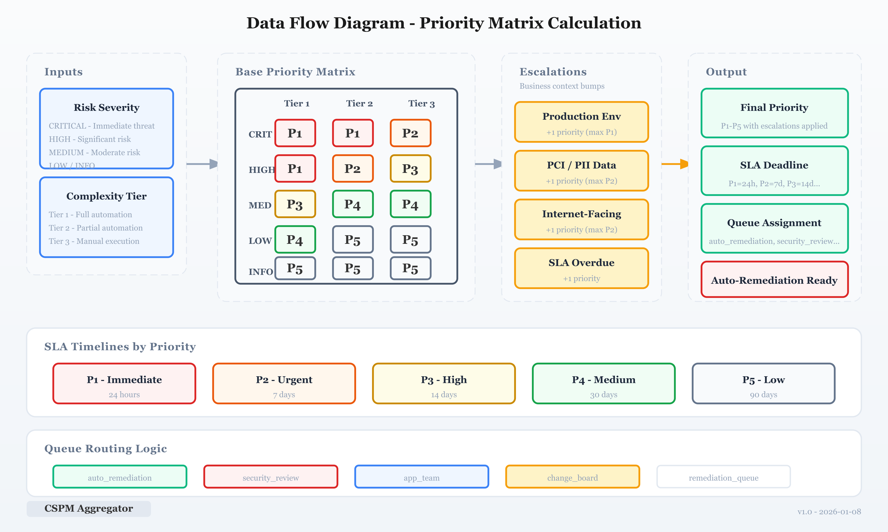

# CSPM Aggregator

[](https://go.dev/)
[](docs/HLD.md)
[](LICENSE)
[](https://anthropic.com)

**Cross-cloud CSPM automation platform with AI-powered contextual risk scoring and remediation complexity analysis.**

---

## Overview

CSPM Aggregator transforms raw security findings from AWS Security Hub, Azure Defender for Cloud, and GCP Security Command Center into **prioritized, actionable work items** through:

- **AI-Powered Risk Scoring** - Contextual severity adjustment using business context, compensating controls, and historical patterns
- **Remediation Complexity Analysis** - Automatic classification by automation candidacy and coordination requirements  
- **Priority Matrix** - Combined risk + complexity scoring into P1-P5 prioritization with SLA tracking
- **Quick Win Identification** - Auto-detection of high-impact findings that can be remediated immediately
- **Workflow Automation** - Asana task sync, email distribution, and auto-remediation triggers

## Architecture





<details>
<summary>Text diagram (expand)</summary>

```
┌─────────────────────────────────────────────────────────────────────────────┐
│                         CSPM Aggregator Platform                            │
├─────────────────────────────────────────────────────────────────────────────┤
│                                                                             │
│  AWS Security Hub ──┐                                                       │
│  Azure Defender ────┼──► Normalizer ──► AI Scoring ──► Priority Matrix      │
│  GCP SCC ───────────┘                                                       │
│                                                                             │
│  AI Scoring Layer:                                                          │
│  ┌─────────────────┐  ┌─────────────────┐  ┌─────────────────┐             │
│  │ Risk Scorer     │  │ Complexity      │  │ Priority        │             │
│  │ - LLM Analysis  │  │ Normalizer      │  │ Calculator      │             │
│  │ - FP Detection  │  │ - 25+ Rules     │  │ - P1-P5         │             │
│  │ - Guardrails    │  │ - AI Fallback   │  │ - SLA Tracking  │             │
│  └─────────────────┘  └─────────────────┘  └─────────────────┘             │
│                                                                             │
│  Output Queues:                                                             │
│  ├── Auto-Remediation (P1-P2 + Tier1) ──► Execute immediately              │
│  ├── Security Review (P1-P2 + Tier2-3) ──► Manual remediation              │
│  ├── App Team Queue ──► Coordination required                              │
│  └── Normal Queue (P3-P5) ──► Scheduled remediation                        │
│                                                                             │
└─────────────────────────────────────────────────────────────────────────────┘
```

</details>

## Key Features

| Feature | Description |
|---------|-------------|
| **Contextual Risk Scoring** | LLM analyzes 30+ context signals to adjust severity beyond raw CSPM output |
| **False Positive Detection** | Historical pattern analysis auto-accepts findings with high FP rates |
| **Complexity Tiers** | Tier 1 (auto-remediate), Tier 2 (partial), Tier 3 (manual coordination) |
| **Priority Matrix** | Risk × Complexity → P1-P5 with automatic escalations |
| **Quick Wins Report** | Identifies P1-P2 + Tier1 findings for immediate impact |
| **SLA Tracking** | Automatic deadline calculation and overdue escalation |
| **Zero Stored Credentials** | OIDC, Managed Identity, Workload Identity Federation |

## Quick Start

### Prerequisites

- Go 1.21+
- AWS account with Security Hub enabled
- Azure subscription with Defender for Cloud
- GCP project with Security Command Center
- Anthropic API key (for AI scoring)

### Installation

```bash
# Clone repository
git clone https://github.com/lvonguyen/cspm-aggregator.git
cd cspm-aggregator

# Install dependencies
go mod download

# Build
go build -o bin/aggregator ./cmd/aggregator
```

### Configuration

```bash
# Cloud authentication (zero stored credentials)
export AWS_ROLE_ARN=arn:aws:iam::123456789012:role/cspm-reader
export AZURE_TENANT_ID=xxx
export AZURE_USE_MSI=true
export GCP_ORG_ID=123456789
export GCP_WIF_CONFIG_PATH=/path/to/wif-config.json

# AI scoring
export ANTHROPIC_API_KEY=sk-xxx
export LLM_MODEL=claude-opus-4-6

# Integrations
export ASANA_PAT=xxx
export ASANA_PROJECT_GID=xxx
```

### Run

```bash
# Dry run (no external updates)
./bin/aggregator --dry-run --cloud all

# Run for specific cloud
./bin/aggregator --cloud aws

# Full run with all integrations
./bin/aggregator --cloud all
```

## Project Structure

```
cspm-aggregator/
├── cmd/aggregator/              # Application entrypoint
├── internal/
│   ├── providers/
│   │   ├── aws/securityhub.go   # AWS Security Hub client
│   │   ├── azure/defender.go    # Azure Defender client
│   │   └── gcp/scc.go           # GCP SCC client
│   ├── normalizer/
│   │   └── schema.go            # Common finding schema
│   ├── scoring/                 # AI Scoring Package
│   │   ├── risk_scorer.go       # Contextual risk assessment
│   │   ├── complexity.go        # Remediation complexity
│   │   └── priority.go          # Priority matrix calculation
│   ├── ai/                      # LLM Provider Package
│   │   ├── provider.go          # LLM interface
│   │   └── enricher.go          # Context enricher
│   ├── reporter/                # Report generation
│   ├── asana/                   # Asana task sync
│   └── email/                   # Email notifications
├── configs/
│   └── config.yaml              # Configuration
├── infrastructure/
│   ├── azure-automation/        # Azure Automation setup
│   ├── aws-oidc/                # AWS OIDC federation
│   └── gcp-wif/                 # GCP Workload Identity
├── docs/
│   ├── HLD_CSPM_Aggregator.md   # High-Level Design
│   ├── DDD_CSPM_Aggregator.md   # Detailed Design Document
│   ├── diagrams/                # Architecture & DFD diagrams
│   └── exports/                 # DOCX exports
└── README.md
```

## AI Scoring Deep Dive



### Contextual Risk Scoring

The Risk Scorer uses Claude to analyze findings with full business context:

```
Finding: CVE-2024-1234 on gcp-host-01 (CRITICAL)

Context Signals:
├── Asset Tier: Tier3-Dev
├── Environment: sandbox
├── Network: Isolated VPC, no internet exposure
├── Controls: EDR enabled, egress restricted
├── Vulnerability: Package not in runtime path
└── History: 3 prior FPs for this CVE type

AI Assessment:
├── Adjusted Severity: LOW (downgraded)
├── Confidence: 0.85
├── Rationale: "Package not in use, isolated sandbox, strong controls"
└── Recommendation: accept_risk
```

### Complexity Tiers

| Tier | Examples | Automation |
|------|----------|------------|
| **Tier 1** | S3 public access, logging, tags, IMDSv2 | Full automation |
| **Tier 2** | Security groups, IAM policies, TLS config | Partial (needs review) |
| **Tier 3** | Database config, network redesign, critical patches | Manual + coordination |

### Priority Matrix



|                 | Tier 1 | Tier 2 | Tier 3 |
|-----------------|--------|--------|--------|
| **CRITICAL**    | P1     | P1     | P2     |
| **HIGH**        | P1     | P2     | P3     |
| **MEDIUM**      | P3     | P4     | P4     |
| **LOW**         | P4     | P5     | P5     |

= Auto-remediation candidate

## API Endpoints

```bash
# Get prioritized findings
GET /api/v1/findings?priority=P1,P2&automation_candidate=true

# Dashboard summary
GET /api/v1/dashboard/summary

# Quick wins report
GET /api/v1/reports/quick-wins
```

## Security

- **Zero Stored Credentials**: All cloud access via OIDC/WIF/Managed Identity
- **Read-Only Access**: SecurityAudit / Reader roles only
- **No PII in Prompts**: Finding context sanitized before AI analysis
- **Secrets in Key Vault**: API keys retrieved at runtime

---

## Documentation

| Document | Description |
|----------|-------------|
| [HLD](docs/HLD_CSPM_Aggregator.md) | High-Level Design — system architecture, data flows, and component interactions |
| [DDD](docs/DDD_CSPM_Aggregator.md) | Detailed Design — implementation specifications, schema definitions, and API contracts |
| [Schema Reference](docs/SCHEMA_REFERENCE.md) | Common finding schema and field definitions |
| [Standards](docs/STANDARDS.md) | Coding and integration standards |

---

## Roadmap

- [x] Multi-cloud finding aggregation
- [x] AI-powered risk scoring
- [x] Remediation complexity tiers
- [x] Priority matrix calculation
- [ ] Auto-remediation execution (Tier1)
- [ ] ServiceNow integration
- [ ] Splunk dashboard
- [ ] CloudForge IDP integration

## Contact

**Author:** Liem Vo-Nguyen  
**Email:** liem@vonguyen.io  
**LinkedIn:** [linkedin.com/in/liemvonguyen](https://linkedin.com/in/liemvonguyen)

## License

MIT License - see [LICENSE](LICENSE) for details.
